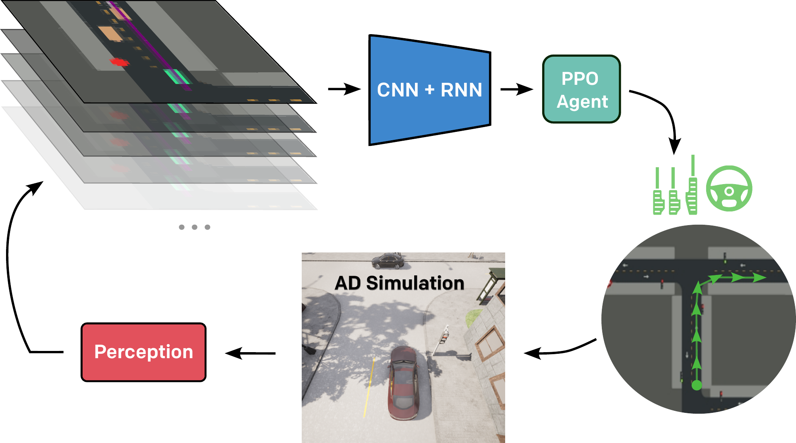
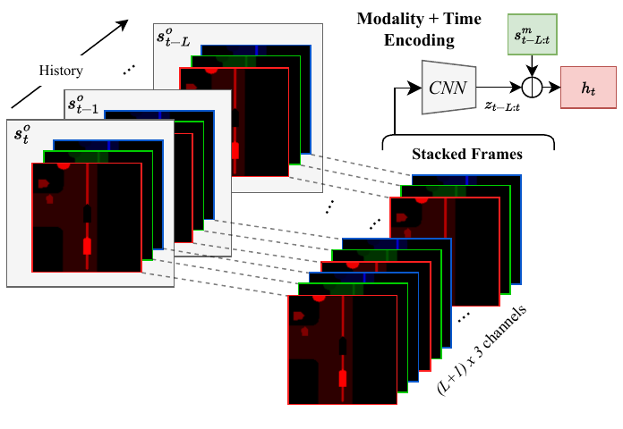
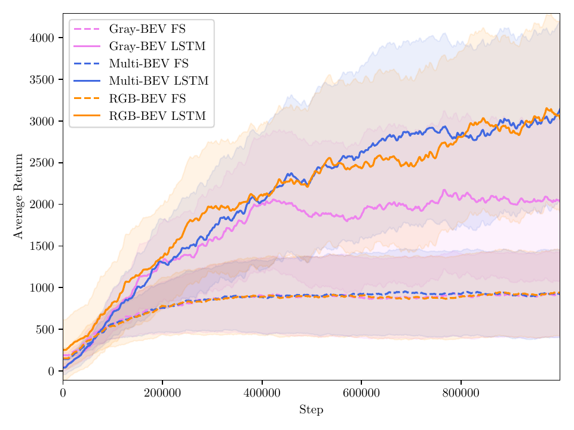

# Efficient Learning of Urban Driving Policies Using Bird's-Eye-View State Representations

[](https://github.com/RichardLitt/standard-readme)

This repository is the official implementation of the [paper](https://ieeexplore.ieee.org/abstract/document/10422281):

> **Efficient Learning of Urban Driving Policies Using Bird's-Eye-View State Representations**
>
> [Trumpp, Raphael](https://scholar.google.com/citations?user=2ttMbLQAAAAJ&hl=en), [Martin Buechner](https://rl.uni-freiburg.de/people/buechner), [Abhinav Valada](https://rl.uni-freiburg.de/people/valada),
> and [Marco Caccamo](https://scholar.google.com/citations?user=Jbo1MqwAAAAJ&hl=en&oi=ao).

The paper was presented at the IEEE International Conference on Intelligent Transportation Systems 2023. If you find
our work useful, please consider [citing](#reference) it.

<p align="center">
  
</p>

## Table of contents

- [Background](#background)
- [Install](#install)
- [Usage](#usage)
- [Reference](#reference)
- [License](#license)

## Background

Autonomous driving involves complex decision-making in highly interactive environments, requiring thoughtful negotiation
with other traffic participants.
While reinforcement learning provides a way to learn such interaction behavior, efficient learning critically depends on
scalable state representations.
Contrary to imitation learning methods, high-dimensional state representations still constitute a major bottleneck for
deep reinforcement learning methods in autonomous driving.
In this paper, we study the challenges of constructing bird's-eye-view representations for autonomous driving and
propose a recurrent learning architecture for long-horizon driving.
Our PPO-based approach, called RecurrDriveNet, is demonstrated on a simulated autonomous driving task in CARLA, where it
outperforms traditional frame-stacking methods while only requiring one million experiences for efficient training.
RecurrDriveNet causes less than one infraction per driven kilometer by interacting safely with other road users.

### Our Contribution

Current reinforcement learning approaches for learning driving policies face the bottleneck of dimensionality. In this
paper, we evaluate the efficiency of various bird's-eye-view representations used for describing the state of the
driving scene. In addition to that, we propose a novel LSTM-based encoding scheme for efficiently encoding the
bird's-eye-view state representation across the full trajectory of states in a reinforcement learning fashion. This
alleviates the need for old-fashioned frame-stacking methods and enables further long-horizon driving research.

<p align="center">
  
  
  
</p>

### Results

Based on our chosen LSTM-based encoding of bird's-eye-view representations, we achieve significantly higher average
returns while reducing the number of infractions when driving compared to frame-stacking methods. This allows also
robust stopping at red traffic lights.

#### Training

<p align="center">
  
</p>

#### Driving Behavior

<p align="center">
  
</p>

## Install

- We recommend to use a virtual environment for the installation:
    ```bash
    python -m venv learning2drive
    source learning2drive/bin/activate
    ```
- Activate the environment and install the following packages:
    ```bash
    pip install torch==2.0
    pip install torchvision==0.15.1
    pip install torchrl==0.0.2a
    pip install tensordict==0.1.0
    pip install pygame==2.3.0
    pip install carla==0.9.14
    pip install numba==0.56.4
    pip install gymnasium== 0.28.1
    pip install hydra-core tensorboard torchinfo wandb tqdm pynvml nvsmi scikit-image matplotlib opencv-python
    ```
- Most of the code is documented with *automatically* generated docstrings, please use them with caution.

## Usage

### Training and Evaluation

- Training of the PPO agent can be done by running the following command using a specific configuration file:
  ```bash
  python training.py -cn <config_name>
  ```
  where `<config_name>` is the name of the configuration file located in the `configs` directory, e.g, the command
  ```bash
  python training.py -cn config_multi_bev_lstm
  ```
  trains the agent using the configuration file `configs/config_multi_bev_lstm.yaml`.

- Trained agents must be placed in the `trained_agents` directory. The trained agent can be evaluated by running the
  following command:

  ```bash
  python inference.py
  ``` 

- The configuration files provide option to define GPU placement, training parameters, and the environment setup. The
  configuration files are located in the `configs` directory.

- You must **not** start Carla instances manually. The training script will start the Carla server automatically, but
  `$CARLA_ROOT` must be set to the root directory of the Carla installation, e.g.,
  `export CARLA_ROOT=/opt/carla-simulator/`. Sometimes the connection to the Carla server cannot be established. In this
  case, please restart the script and make sure that no other Carla instances are running in the background. If the
  problem persists, consider reducing the number of parallel environments. The command `pkill -ef carla` can be useful
  to do so.

### Versioning

The results of the paper where created using the listed [packages](#Install) with python3.8.10 and Carla0.9.14.
Other versions of the packages might not be compatible with the provided code.

## Reference

If you find our work useful, please consider citing our paper:

```bibtex 
@inproceedings{trumpp2023efficient,
  author={Trumpp, Raphael and Büchner, Martin and Valada, Abhinav and Caccamo, Marco},
  booktitle={2023 IEEE 26th International Conference on Intelligent Transportation Systems (ITSC)}, 
  title={Efficient Learning of Urban Driving Policies Using Bird's-Eye-View State Representations}, 
  year={2023},
  pages={4181-4186},
  doi={10.1109/ITSC57777.2023.10422281}
  }
```

## License

[GNU General Public License v3.0 only" (GPL-3.0)](LICENSE.txt) © [raphajaner](https://github.com/raphajaner)
